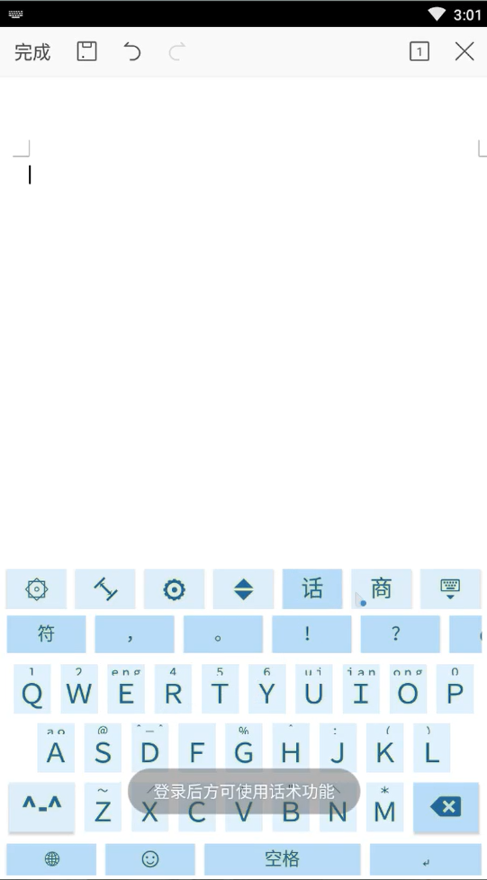
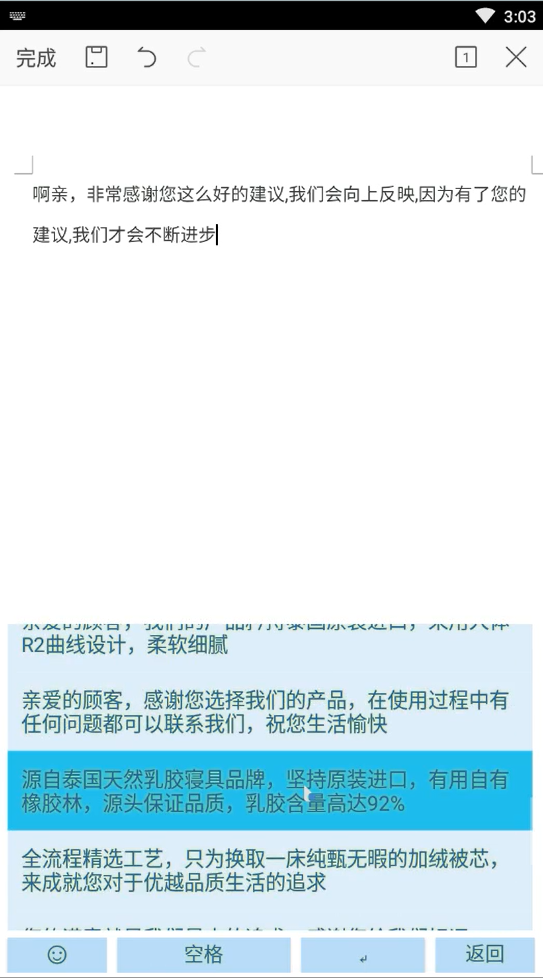
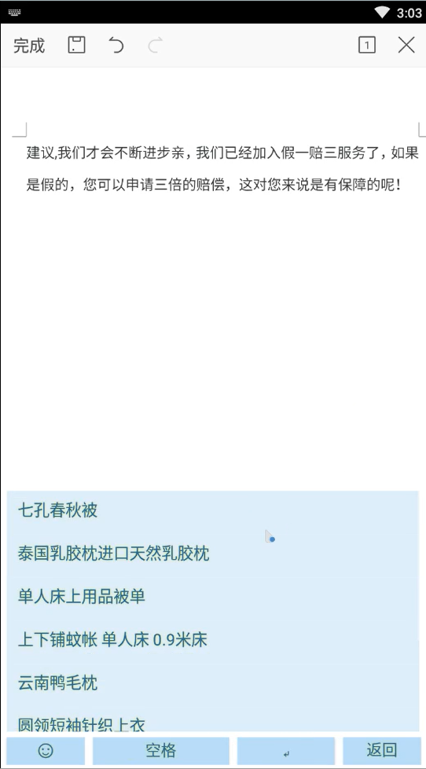
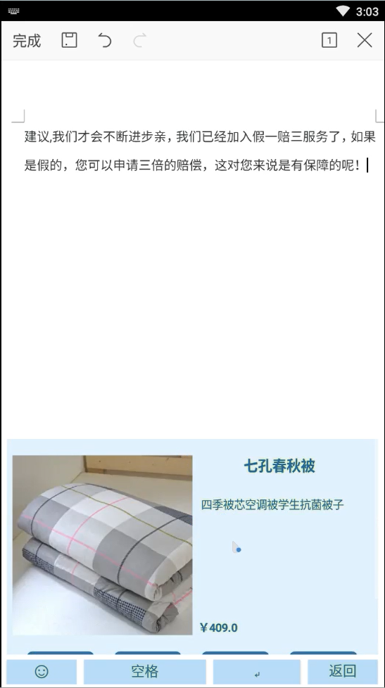
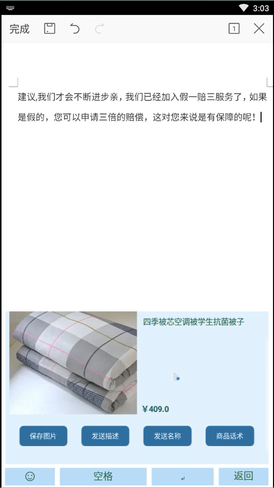
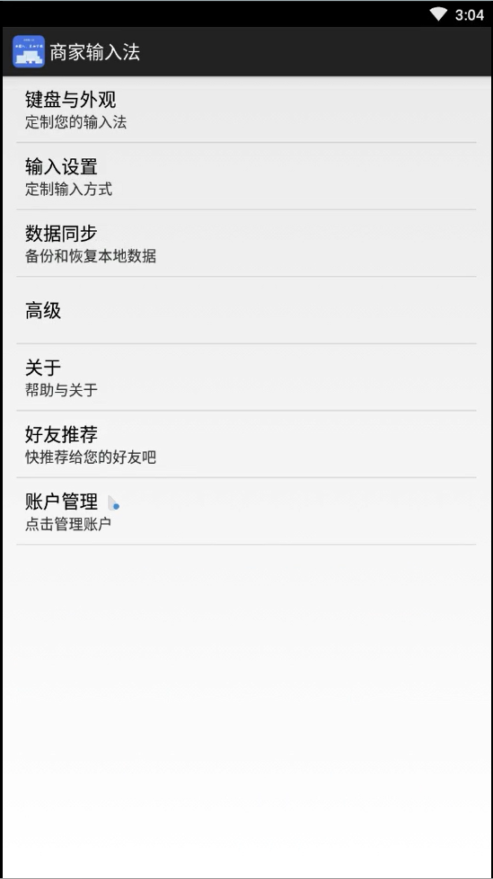
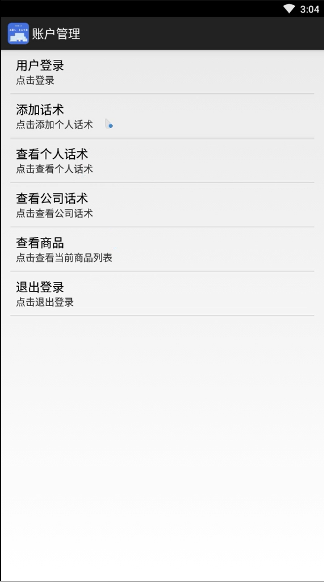
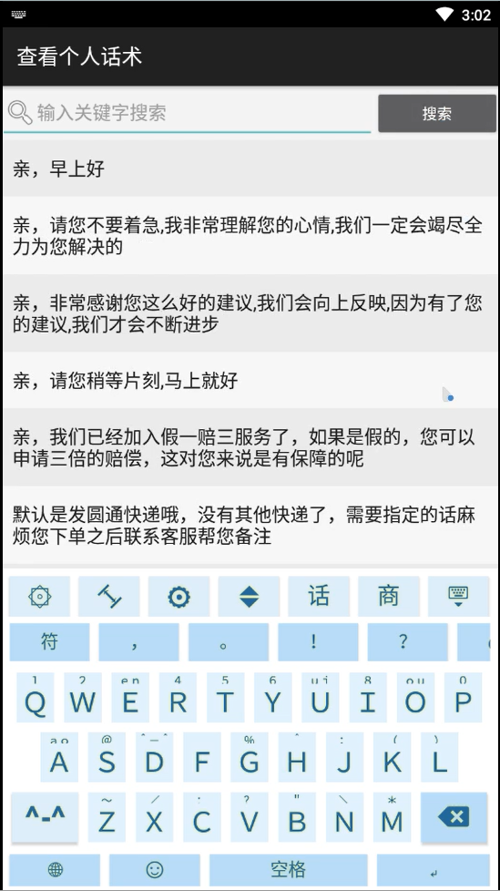
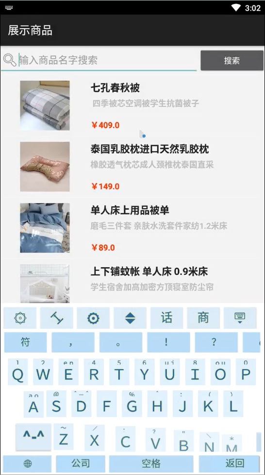

# 商家输入法
- 大三软工实训项目
- 一个为商家输入法App客户端\一个为后台管理系统Web端
- 项目的App客户端在别人的Wi-inputMethod项目`https://github.com/WiInputMethod/VE`上添加功能，做的很菜，且整个项目的结构较混乱，仅供参考和纪念

若要使用该客户端，首先需要运行后台管理系统。

- 后台管理系统需要在yml文件中对数据库进行设置，该项目对应的数据库sql文件存放在后台管理系统文件夹中。

客户端只能在arm模拟器上运行，效果图如下：

话术功能：点击可发送对应话术

商品查看功能：

- 商品名

- 点入商品名后有商品信息

- 商品信息下有对应操作，保存图片、发送描述、发送名称、和该商品对应的话术

- 在设置中心有用户登录、查看话术和商品之类的功能

